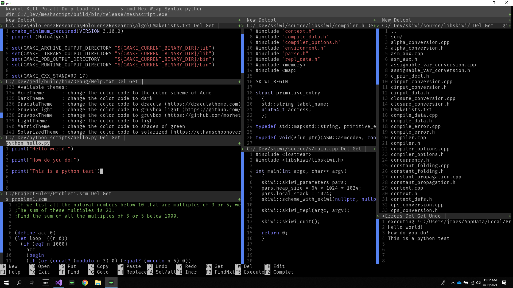
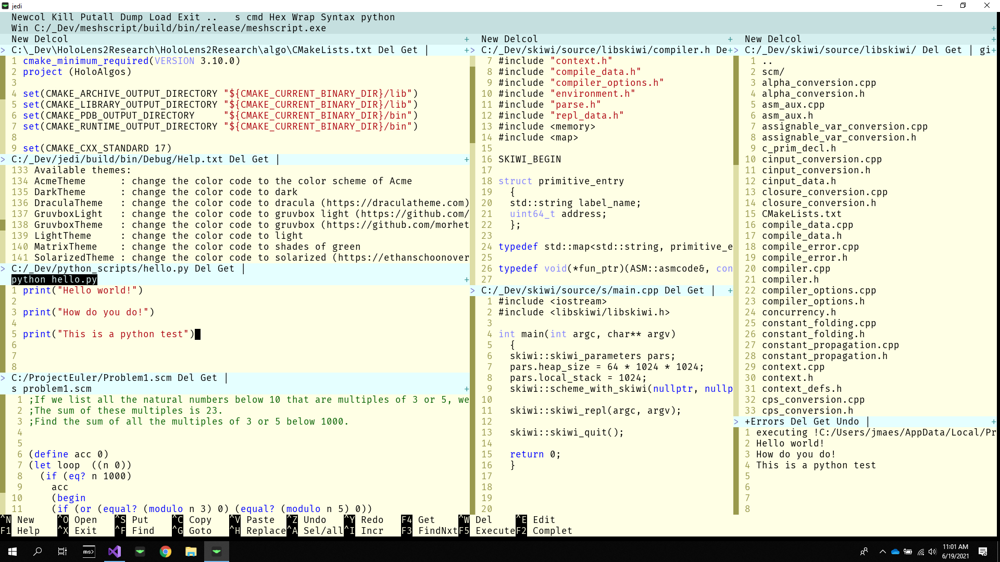
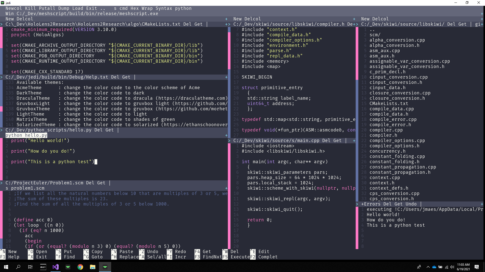
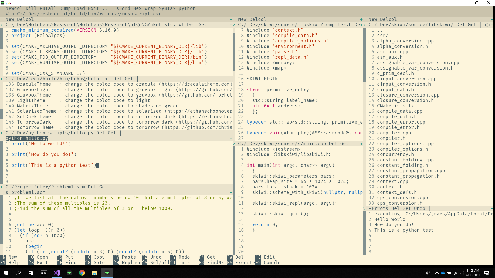

# Text Editor

a minimalist text editor inspired by [Acme](http://acme.cat-v.org/) and [Nano](https://github.com/madnight/nano).

Building
--------
First of all, Text Editor uses submodules, so don't forget to also call

     git submodule update --init

Next, run CMake to generate a solution file on Windows, a make file on Linux, or an XCode project on MacOs.
You can build jed without building other external projects (as all necessary dependencies are delivered with the code). 

Text Editor basics
-----------

Text Editor is a minimalist text editor based on the text editor Acme by Rob Pike, 
and on the text editor Nano that is installed by default in Ubuntu and
other Linux distributions.
Apart from editing text you can also use Text Editor to browse the file system, or
to run programs.

When you start Text Editor, you have the main command layer at the top. Some very
general commands are visible, like Newcol or Exit. When middle clicking on 
Newcol, new columns will be generated, where each column has a corresponding
column command window on top where specific commands for columns appear, such
as New (create an empty window) or Delcol (delete the column). When middle
clicking on New, empty windows will be added to the column. You can now type
any content in the corresponding editor window. If you want to save the content 
you typed to a file, then type the filename in the corresponding command window 
at the top left position, and middle click on Put to save.
You can also type the name of an existing file anywhere and right click on 
that filename. The corresponding file will be openened in a new window in 
the corresponding column. 
You can add commands to the command windows at will, you even can add 
commands to your editor window. If you're lacking space in the command 
window, you can increase the window by dragging the '+' sign in the lower
right corner.

In the remainder of the text, ^ means the left or right Ctrl button.
On MacOs you can also use the left or right Command button instead of Ctrl.
At the bottom of the screen you can see some useful shortcuts, such as ^N
for making a new emtpy window.

When starting Text Editor in a terminal, you can optionally provide an argument to Text Editor. 
If this argument is a file, then Text Editor will open this file for editing. 
If the argument is a folder, then Text Editor will open this folder for browsing. 
If the argument is preceded by =, Text Editor will consider the argument as
an executable program that is started via a forking process or pipe.
If no argument is provided, Text Editor will start up in the same state as
your previous session.

The mouse is important in Text Editor. Each mouse button does different things.
You'll need to use all three buttons of the mouse. If your mouse only has
two buttons, then the middle button is replaced by Ctrl + the left button.

- The left button can be used to select text. If you press Alt, you can
  select rectangular regions. If you double click, the whole word will be
  selected.
  If you click on the scrollbar on the left with the left mouse button, the
  view will move up. If you click at the top of the scrollbar, the view 
  will move up by one line. If you click at the bottom of  the scrollbar, 
  the view will move up by one page.
- The middle button can be used to execute commands. If you middle click 
  on the text Open, then the command to open a file will be executed.
  If you middle click on cmd in Windows, a command editor will start. If 
  you middle click on <ls in Linux, the current path's directory listing
  will be printed inside your editor window. If you want to execute
  a process consisting of several commands, then you can first select this
  command line with the left mouse button, and then middle click on the
  selection.
  With the standard Linux characters |, <, > you can build pipes. Any 
  selection in the editor will be sent to the process if the process is 
  preceded by | or >. Any output of the process is sent to the editor
  if the process is preceded by | or <. For instance middle clicking on
  <date in Linux will print the date at the position of the cursor in the 
  current active window.
  If you click the scrollbar with the middle mouse button, you will move
  your editor view to the fraction of the text corresponding to the 
  fraction of the scrollbar where you clicked.
- The right button is used to open or find things. If you right click on
  a word representing a file, the file will be opened in a new window.
  If you right click on a word that is not a file, Text Editor will locate the next
  occurence of this word in the current text.
  If you right click on a word representing a folder, Text Editor will open a new
  window where you can browse this folder.
  It is also possible to bind file extensions to an external program. If you
  right click on a file that is bound to an external program, this external
  program will start up and open the file. This is for instance useful for
  opening png or jpg files with an image editing program. The binding of
  extensions to external programs is done via a file plumber.json that 
  exists in the same folder as your Text Editor executable.
- Windows can be controlled by the mouse. Make windows or columns of windows
  larger or smaller by dragging the '+' sign at the right bottom corner of
  a command window. Drag the '>' sign to move windows around or change their
  order. Left click on '>' to make the corresponding editor window larger by
  exactly one line. Middle click on '>' to make the corresponding editor
  window as large as possible while still viewing all other command windows
  in that column. Right click on '>' to maximize the current editor window.
  The other windows will be hidden. Simply click again on '>' to make the
  other windows appear again.

The following commands/shortcuts are currently available in Text Editor 
(^ stands for Ctrl):

    F1             : show this help text
    ^F3            : find the current selection
    F3             : find next occurence
    F5             : refresh active file or folder
    AllChars       : toggle printing of all characters
    Cancel, ^x     : cancel the current operation
    Case           : swap case sensitivity when searching
    Copy, ^c       : copy to the clipboard (pbcopy on MacOs, xclip on Linux)
    Dump           : write the state of Text Editor to the current cursor position
    Edit <command> : Treat the argument as a text editing command in the style of sam
                     (http://doc.cat-v.org/plan_9/4th_edition/papers/sam/)
                     See below for an overview of valid commands
    Exit, ^x       : exit Text Editor
    Find , ^f      : find a word
    Get, F5        : refresh the current file or folder
    Goto , ^g      : go to line
    Help, F1       : show this help text
    Hex <file>     : loads the file in hexagonal notation
    Incr, ^i       : incremental search
    Kill           : kill the current running piped process if any 
                     (cfr. Win command)
    LineNumbers    : toggle visualization of line numbers
    Load           : restore the state of Text Editor from a selection representing a file or a dump
    New, ^n        : make an empty buffer
    Open, ^o       : open a new file or folder
    Paste, ^v      : paste from the clipboard (pbpaste on MacOs, xclip on Linux)
    Put, ^s        : save the current active file
    Putall         : save all modified files
    Redo, ^y       : redo
    Replace, ^h    : find and replace
    Sel/all, ^a    : select all
    Syntax         : turn on/off syntax highlighting. Very large files 
                     can be slow when syntax highlighting is turned on.
    TabSpaces      : toggle tab between spaces and real tab
    Tab <nr>       : Make tab nr spaces wide
    Win <command>  : Make a piped Text Editor instance running the command, e.g. Win cmd 
                     will run Window's command shell inside Text Editor.
    Wrap           : Toggle wrapping of lines in the editor window
    Undo, ^z       : undo
    
    Available themes:
    AcmeTheme      : change the color code to the color scheme of Acme
    DarkTheme      : change the color code to dark
    DraculaTheme   : change the color code to dracula (https://draculatheme.com)
    GruvboxLight   : change the color code to gruvbox light (https://github.com/morhetz/gruvbox)
    GruvboxTheme   : change the color code to gruvbox (https://github.com/morhetz/gruvbox)
    LightTheme     : change the color code to light
    MatrixTheme    : change the color code to shades of green
    SolarizedTheme : change the color code to solarized (https://ethanschoonover.com/solarized/)
    SolDarkTheme   : change the color code to solarized dark (https://ethanschoonover.com/solarized/)
    TomorrowDark   : change the color code to tomorrow dark (https://github.com/chriskempson/tomorrow-theme)
    TomorrowTheme  : change the color code to tomorrow (https://github.com/chriskempson/tomorrow-theme)
    
    Available fonts:
    Comic          : change the font to Comic-mono (https://dtinth.github.io/comic-mono-font/)
    Consolas       : change the font to Consolas (https://en.wikipedia.org/wiki/Consolas)
    DejaVu         : change the font to DejaVuSansMono (https://www.fontsquirrel.com/fonts/dejavu-sans-mono)
    Fantasque      : change the font to Fantasque-sans (https://github.com/belluzj/fantasque-sans/)
    FiraCode       : change the font to Fira Code (https://github.com/tonsky/FiraCode)
    Hack           : change the font to Hack (https://sourcefoundry.org/hack/)
    Inconsolata    : change the font to inconsolata (https://fonts.google.com/specimen/Inconsolata)
    Menlo          : change the font to Menlo (https://en.wikipedia.org/wiki/Menlo_(typeface))
    Monaco         : change the font to Monaco (https://en.wikipedia.org/wiki/Monaco_(typeface))
    Noto           : change the font to Noto (https://www.google.com/get/noto/)
    Victor         : change the font to Victor-mono (https://rubjo.github.io/victor-mono/)
    
    Short overview of the Edit command functionality:
      In the following, dot is shorthand for the selected text.
      The value of dot may be changed by specifying an address.
    
      Simple addresses:
      #n                : The empty string after character n
      n                 : Line n
      /regexp/          : The first following match of the regular expression
      -/regexp/         : The first previous match of the regular expression
      $                 : The null string at the end of the file
      .                 : Dot
      
      Compound addresses:
      a1+a2             : The address a2 evaluated starting at right of a1
      a1-a2             : a2 evaluated in the reverse direction starting at left of a1
      a1,a2             : From the left of a1 to the right of a2 (default 0,$)
      
      Some examples:
      Edit 3 refers to the third line of the file
      Edit $-3 is the third line before the end of the file
      Edit .+1 is the line after the current dot (selection)
      Edit /x/ matches the next x character in the file
      
      Available Edit commands:
      a/text/           : Append text after dot
      c/text/           : Change text in dot
      i/text/           : Insert text before dot
      d                 : Delete text in dot
      s/regexp/text/    : Substitute text for match of regular expression
      m address         : Move text in dot after address
      t address         : Copy text in dot after address
      e filename        : Replace file with named disc file
      r filename        : Replace dot by contents of named disc file
      w filename        : Write file to named disc file
      x/regexp/ command : For each match of regexp, set dot and run command
      y/regexp/ command : Between adjacent matches of regexp, set dot and run command
      g/regexp/ command : If dot contains a match of regexp, run command
      v/regexp/ command : If dot does not contain a match of regexp, run command
      u n               : Undo last n (default 1) changes
      
      Some examples:
      Edit 3d deletes the third line of the file
      Edit 0,$ x/Peter/ d searches the whole file for the occurence of Peter and runs the d command (which will thus delete each occurence of Peter). Note that 0,$ can be replaced by its shorthand ,
      Edit , c/AAA/ will change the content of the file with AAA
      Edit , g/Peter/ d deletes the whole file if Peter occurs anywhere in the text
     

When Text Editor is closed, it will save any user settings in a file 
Text Editor_settings.json which lives next to the executable file Text Editor. It is 
possible to override certain settings. In the same folder, make a file 
Text Editor_user_settings.json and put here the settings that you want to control. 
You can, for instance, make your own color scheme here, or point to a custom
font that you'd like to use.

Text Editor screenshots
----------------
Below are some screenshots showing different Text Editor themes.

